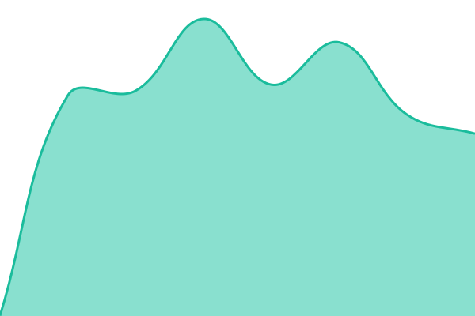
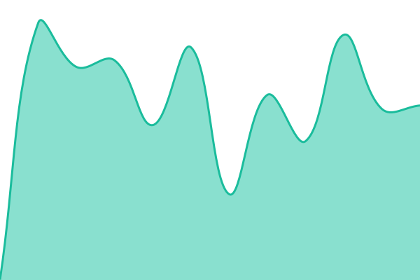
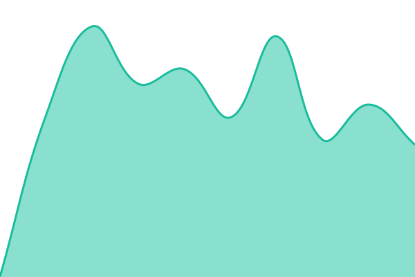

# [📈 Live Status](https://demo.upptime.js.org): <!--live status--> **🟧 Partial outage**

This repository contains the open-source uptime monitor and status page for [Clarity BHS](https://www.claritybhs.com/), powered by [Upptime](https://github.com/upptime/upptime).

With [Upptime](https://upptime.js.org), you can get your own unlimited and free uptime monitor and status page, powered entirely by a GitHub repository. We use [Issues](https://github.com/Clarity-BHS/upptime/issues) as incident reports, [Actions](https://github.com/Clarity-BHS/upptime/actions) as uptime monitors, and [Pages](https://demo.upptime.js.org) for the status page.

<!--start: status pages-->
<!-- This summary is generated by Upptime (https://github.com/upptime/upptime) -->
<!-- Do not edit this manually, your changes will be overwritten -->
<!-- prettier-ignore -->
| URL | Status | History | Response Time | Uptime |
| --- | ------ | ------- | ------------- | ------ |
|  [PROD - engagebyclarity.com](https://engagebyclarity.com/) | 🟩 Up | [prod-engagebyclarity-com.yml](https://github.com/Clarity-BHS/upptime/commits/HEAD/history/prod-engagebyclarity-com.yml) | 

 548ms
     
 | 

<a href="https://status.engagebyclarity.com/history/prod-engagebyclarity-com">100.00%</a>
    

|  [SANDBOX - staging.engagebyclarity.com](https://staging.engagebyclarity.com/) | 🟩 Up | [sandbox-staging-engagebyclarity-com.yml](https://github.com/Clarity-BHS/upptime/commits/HEAD/history/sandbox-staging-engagebyclarity-com.yml) | 

 706ms
     
 | 

<a href="https://status.engagebyclarity.com/history/sandbox-staging-engagebyclarity-com">100.00%</a>
    

|  [DEV - dev.engagebyclarity.com](https://dev.engagebyclarity.com/) | 🟥 Down | [dev-dev-engagebyclarity-com.yml](https://github.com/Clarity-BHS/upptime/commits/HEAD/history/dev-dev-engagebyclarity-com.yml) | 

 427ms
     
 | 

<a href="https://status.engagebyclarity.com/history/dev-dev-engagebyclarity-com">100.00%</a>
    

|  [PROD - claritybhs.com](https://dev.engagebyclarity.com/) | 🟥 Down | [prod-claritybhs-com.yml](https://github.com/Clarity-BHS/upptime/commits/HEAD/history/prod-claritybhs-com.yml) | 

 361ms
     
 | 

<a href="https://status.engagebyclarity.com/history/prod-claritybhs-com">100.00%</a>
    

<!--end: status pages-->

[**Visit our status website →**](https://demo.upptime.js.org)

## 📄 License

- Powered by: [Upptime](https://github.com/upptime/upptime)
- Code: [MIT](./LICENSE) © [Anand Chowdhary](https://anandchowdhary.com), supported by [Pabio](https://pabio.com)
- Data in the `./history` directory: [Open Database License](https://opendatacommons.org/licenses/odbl/1-0/)
